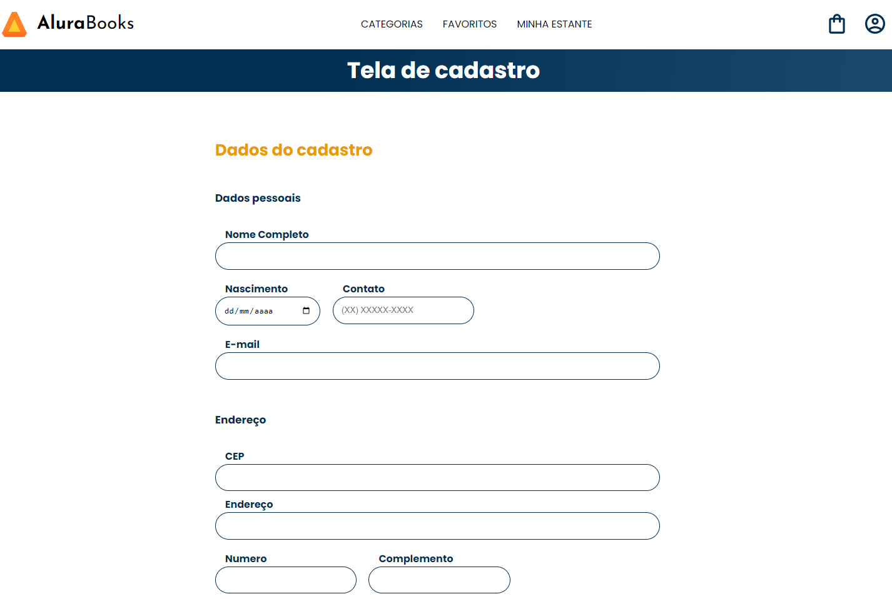

# AluraBooksJS

Projeto "Alura Books" trabalhando os conceitos de API e Await/Async em JavaScript.

## Screenshots

## Ferramentas Utilizadas

- HTML
- CSS
- JavaScript
- Via CEP API

## Funcionalidades
- Inserção automática do bairro, cidade, uf (unidade federativa) e endereço através do CEP;
- Mensagem de erro tanto no console como na página através de catch().

## Feito por:

Lucas Kenji
